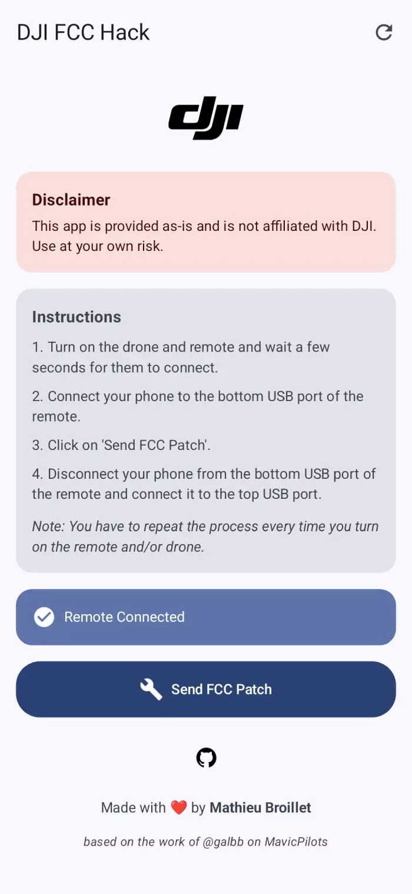
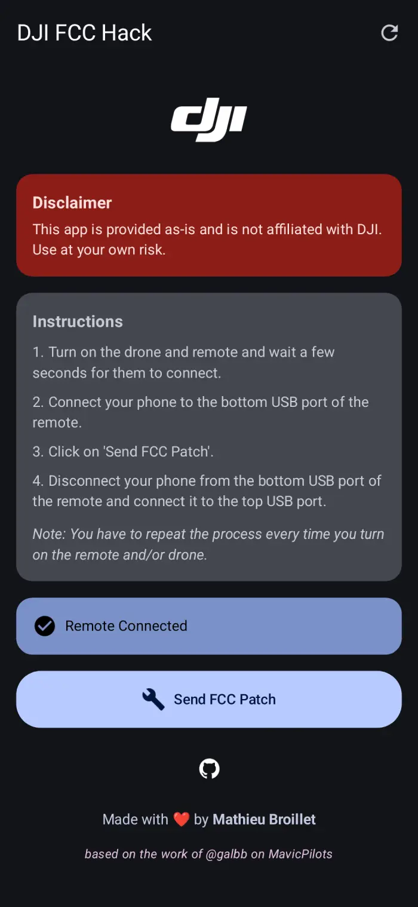
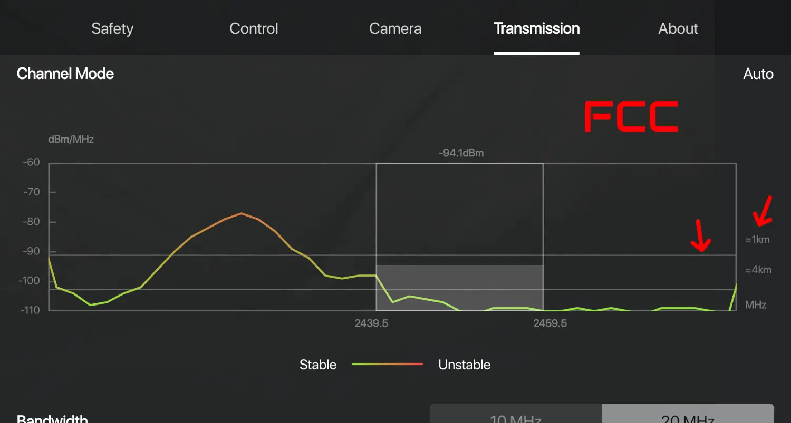
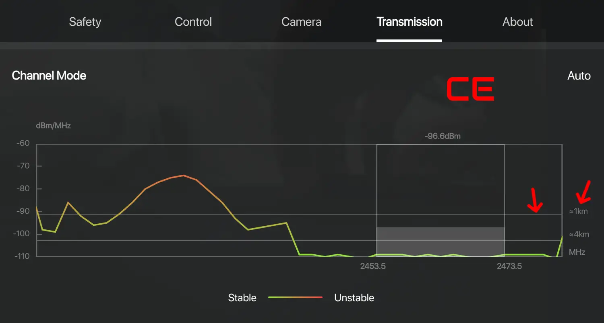

# DJI-FCC-HACK
A simple Android app that forces DJI N1 remotes to FCC

>[!WARNING]
> This only works for drone with DJI N1 remotes. If you have a different remote, this app will not work for you.

## How to use
Download the latest release from the [releases page](https://github.com/M4TH1EU/DJI-FCC-HACK/releases) and install it on your Android device.

>[!IMPORTANT]
> You need to repeat the following steps every time you turn on the drone and/or remote.

Then follow these steps:
1. Turn on the drone and remote and wait a few seconds for them to connect.
2. Connect your phone to the **bottom** USB port of the remote.
3. Click on 'Send FCC Patch'.
4. Disconnect your phone from the bottom USB port of the remote and connect it to the **top** USB port.
5. Enjoy your drone with FCC mode.

## Compatibility
This app should work on any Android device running Android 8 and above.

**Tested on the following drones:**
- DJI Mavic Air 2
- DJI Mini 4K
- DJI Mini 2

>[!NOTE]
> Please let me know if you have tested this app on another drone so I can update this README.

## How do I know if it worked?
Open the DJI Fly app and go to the Transmission tab. Look at the horizontal bar around -90 dBm:
- If it lines up with the 1km mark, your drone is in CE mode.  
- If it falls below the 1km mark, your drone is in FCC mode.  

_Check the images below for reference._

| FCC                           | CE                          |
|-------------------------------|-----------------------------|
|  |  |

## FAQ
### Does this work on iOS?
No, this app is only available for Android.
### Does this work on DJI Smart Controller?
No, this app is only available for N1 remotes (the ones without a screen).
### Does this work on DJI XYZ drone?
Maybe? Give it a try and let me know if it does so I can update this README.
### How does this work?
This app simply sends a command to the remote to switch to FCC mode over the USB port.
### Can I use this app to switch back to CE mode?
No, this app only switches to FCC mode. To switch back to CE mode, you need to turn off the drone and remote and turn them back on.

## Credits
This app is based on the work of [galbb](https://mavicpilots.com/members/galbb.148459/) on the [MavicPilots forum](https://mavicpilots.com/threads/mavic-air-2-switch-to-fcc-mode-using-an-android-app.115027/).
